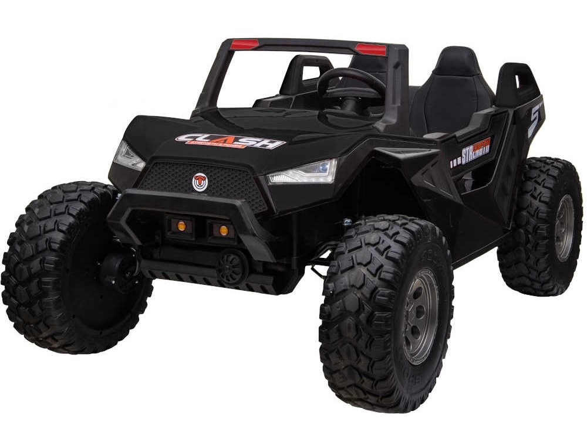
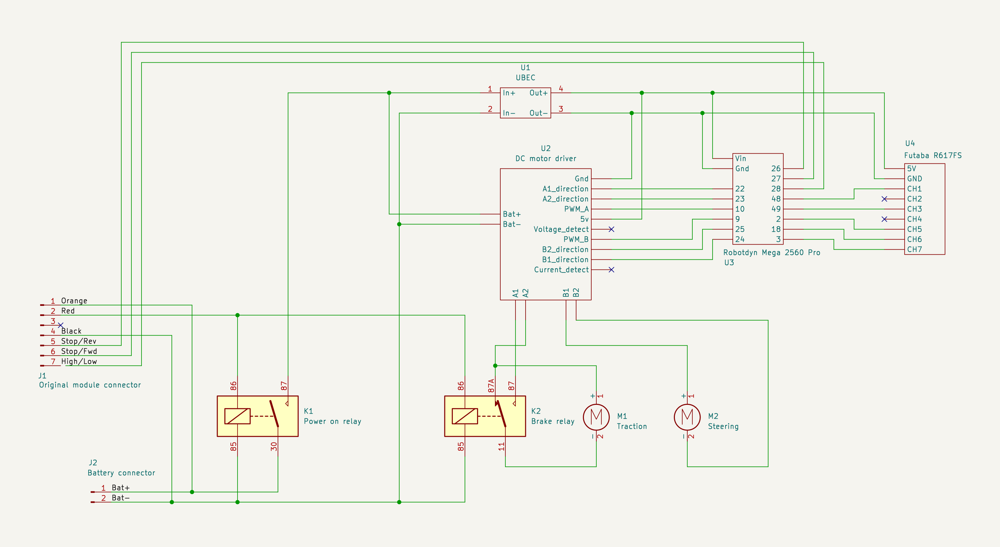
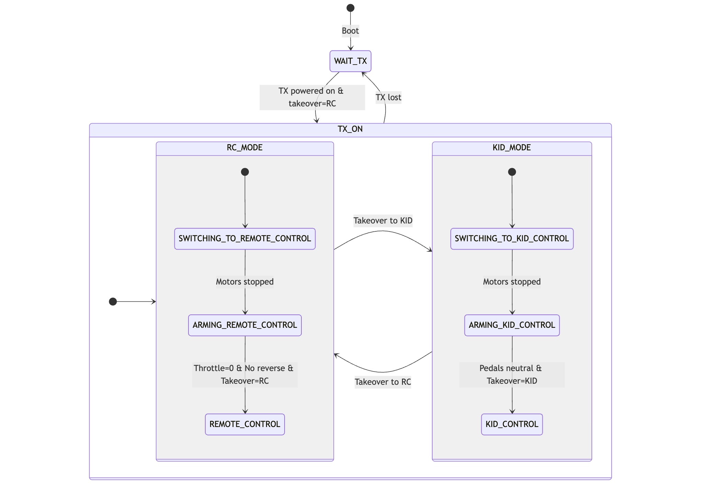

# SX-1928 alternative controller

Control board replacement for the SX-1928 ride-on car, aka "Clash" aka "Challenger" based on a **Futaba R617FS** and a **Robotdyn Mega 2560 Pro** Arduino board.

The original SX-1928 controller board had several shortcomings:

- **Limited speed control**: Only 2 fixed speed settings via on-board switch (or 3 from the RC transmitter)
- **Unsafe downhill speed**: Even the slowest setting is too fast on slopes
- **Sudden stops**: Car comes to a full stop too abruptly throwing children forward when releasing the pedal or the controller's throttle.
- **Poor steering control**: Basic on/off steering with no proportional control

I replaced the original controller with an Arduino Mega 2560 Pro and a Futaba R617FS receiver, and rewrote the firmware to fix the above issues and enhance the overall experience. Here are the main features:

- Fine-grained speed and steering control using the transmitter's analog sticks.
- Configurable acceleration/deceleration profiles prevent sudden speed changes.
- Kid/RC mode switching: the car can be controlled by the transmitter or by the kids using the pedal.
- Adjustable maximum pedal speed via one of the transmitter's analog knobs.
- RC arming procedure prevents the car from moving unless authorized by the parent.

# Hardware Setup

- Receiver: Futaba R617FS (7-channel PWM output)
- Arduino: Robotdyn Mega 2560 Pro
- 100A DC motor drive module: https://aliexpress.com/item/1005005925917904.html
- 1x 24V 40A 4-pin automotive relay: https://www.amazon.es/dp/B0CJHQN6TY
- 1x 24V 40A 5-pin automotive relay: https://www.amazon.es/dp/B07MF5XJP9
- UBEC: Any 24V input, 5V output, 3A rated UBEC will do

Alternatively, 2x 24V 40A 5-pin relays can be used instead of 1x each.

# Electrical Setup

# Pin Mapping

## Receiver Input Pins

| Receiver Channel | Function      | Arduino Pin | Method           | Signal Type | Range/Logic |
|------------------|---------------|-------------|------------------|-------------|-------------|
| **CH1**          | Steering      | **Pin 48**  | Input Capture    | Analog      | 1100-1900μs → 0-255 |
| **CH3**          | Throttle      | **Pin 49**  | Input Capture    | Analog      | 1100-1900μs → 255-0 (inverted) |
| **CH5**          | Reverse       | **Pin 2**   | External Int     | Digital     | >1500μs = ON, ≤1500μs = OFF |
| **CH6**          | Max Throttle  | **Pin 18**  | External Int     | Analog      | 1100-1900μs → 0-255 |
| **CH7**          | Takeover      | **Pin 3**   | External Int     | Digital     | ≤1500μs = ON, >1500μs = OFF |

## Motor Control Output Pins

### Drive Motor

| Function | Arduino Pin | AVR Pin | Timer/PWM | Notes |
|----------|-------------|---------|-----------|-------|
| **A1** | **Pin 22** | PA0 | - | Direction control bit 1 (digital) |
| **A2** | **Pin 23** | PA1 | - | Direction control bit 2 (digital) |
| **PA_PWM** | **Pin 10** | PB4 | Timer2 OC2A | Motor speed PWM (~3.9kHz Phase Correct) |

## Steering Motor

| Function | Arduino Pin | AVR Pin | Timer/PWM | Notes |
|----------|-------------|---------|-----------|-------|
| **B1** | **Pin 24** | PA2 | - | Direction control bit 1 (digital) |
| **B2** | **Pin 25** | PA3 | - | Direction control bit 2 (digital) |
| **PB_PWM** | **Pin 9** | PH6 | Timer2 OC2B | Steering PWM (~3.9kHz Phase Correct) |

## On-board Kid Controls

All switches are active-low: pins float when inactive and pull to GND when active, so they are read using digital inputs with internal pullups enabled. The direction switches (REV/FWD) and the speed selector are wired in series with the pedal, meaning the pedal must be pressed for them to register as active.

| Function | Arduino Pin | AVR Pin | Signal Type | Logic |
|----------|-------------|---------|-------------|-------|
| **REV Pedal** | **Pin 26** | PA4 | Digital | LOW = reverse (active low) |
| **FWD Pedal** | **Pin 27** | PA5 | Digital | LOW = forward (active low) |
| **Speed Select** | **Pin 28** | PA6 | Digital | LOW = HI speed, HIGH = LO speed |

# TX configuration

This is the relevant configuration for the Futaba T7C transmitter.

- Hold `Mode/Page` 
  - `E.POINT`
    - Select `CH1`. Move the right stick left and right to set the steering end points between 1100 and 1900μs. Eg. left: 127%, right: 116%.
    - Select `CH3`. Move the left stick up and down to set the throttle end points between 1100 and 1900μs. Eg. up: 128%, down: 117%.
  - `REVERSE`: set all channels to normal `NOR`.
  - `TH-CUT`: you can assign one of the switches to cut the throttle to 0. Or just disable it by seeting it to `INH`.
  - `FAIL SAFE`: make throttle (CH3) go to 0 when the signal is lost: dial up to set `F/S`, then pull throttle stick down to 0, then push dial 1 sec to save the stick position as the failsafe position. Verify that it works by shutting down the transmitter and checking that the throttle goes to 0.

# Arming procedude

The car always starts in RC (remote control) mode and requires an arming sequence before it will respond to any controls:

1. **Power on transmitter** - Turn on the TX first
2. **Take control** - Switch B up (RC/takeover mode)
3. **Forward mode** - Switch G forward 
4. **Zero throttle** - Pull throttle stick fully down to 0
5. **Armed** - Car is now ready to drive

Once armed, you can control the car via RC or switch to kid control mode (Switch B down). The car will not move until this arming sequence is completed.

# State Machine

See [state_machine.md](doc/state_machine.md) for the state machine diagram and descriptions.

# Safety features

- **Power relay**: the whole car is powered by a 24V 40A 5-pin automotive relay. Turning the switch off will cut power to the car entirely.
- **Power off back EMF brake**: another relay brakes the car by shorting the motor terminals when the power is turned off. 
  - Note the car does not have mechanical brakes! This is a simple electrical brake that uses the back EMF of the motors to brake the car and only works in relatively flat terrain.
- **Acceleration**: motors ramp up linearly to full speed in 5.0 seconds, and ramp down to 0 speed in 1.0 second to prevent passengers from being thrown forward/backward. Actual ramp rates are definable in `RAMP_UP_RATE` and `RAMP_DN_RATE`.
- **Reversing while moving**: if you accidentally or intentionally reverse while the car is moving, the car will first slow down to a full stop, then speed up in the opposite direction following the above acceleration profile.
- **Kid control disabled by default**: car starts in RC (takeover) mode after the TX is powered on and the arming sequence is completed. Only then can you switch to kid control mode turning switch B down.
- **Arming procedure**: the car won't move until the arming sequence is completed:
  - Turn switch B up to take over (RC mode).
  - Turn switch G forward (forward mode).
  - Pull throttle stick down to 0.
  - Arming is completed, now you can control the car with the transmitter or switch to kid control mode turning switch B down.
- **Signal loss**: the car stops if the receiver signal is lost. 
  - Note: fail-safe mode must be configured in the transmitter! See instructions above. 
  - Note: The Futaba T7C / R617FS pair don't have a way to notify signal loss. When configured in fail-safe mode, they will simply pull the throttle to 0 and all other channels keep their last value.
- **Steering dead zone**: the steering stick has a dead zone around the center position to prevent motor movement when the stick is in the center position.
- **Steering hold**: the steering motor operates at a speed proportional to the stick position, i.e., the car turns faster the more you move the stick. However, since the steering motor lacks endstop switches or position feedback, the motor switches to "hold" mode after 2 seconds to prevent overheating and mechanical stress. In hold mode, the motor uses only 5% PWM power to maintain position without generating excessive heat.