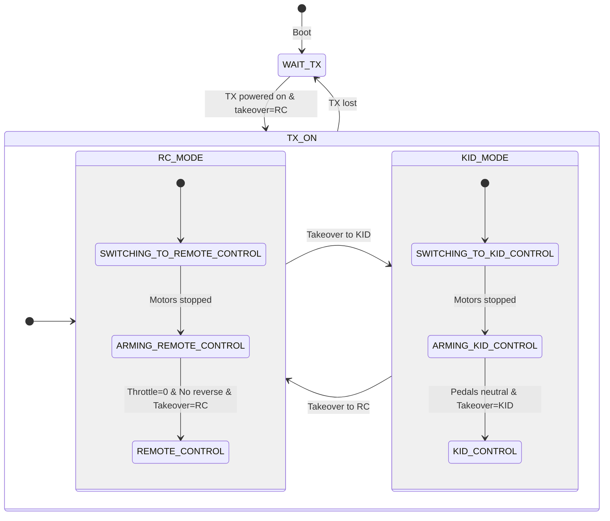

# Mosterrak State Machine

This document describes the control state machine for the Mosterrak system.

## State Diagram

## State Descriptions

### WAIT_TX
- **Purpose**: Initial safe state, waiting for TX to be powered on. Motors are stopped and system is waiting for all 5 PWM channels to become active.
- **Previous state/s**: 
  - Boot (initial state)
  - Any state (when TX signal is lost)
- **Transitions**:
  - TX powered on (all 5 channels active) → `ARMING_REMOTE_CONTROL`

### ARMING_REMOTE_CONTROL
- **Purpose**: Safety check before entering RC control mode. System waits for operator to set safe input conditions (throttle at zero, no reverse) before allowing RC control. Car always boots into this mode for safety.
- **Previous state/s**:
  - `WAIT_TX` (when TX powers on)
  - `SWITCHING_TO_REMOTE_CONTROL` (when motors fully stopped)
- **Transitions**:
  - Throttle == 0 AND reverse switch OFF AND motors stopped AND takeover switch == RC → `REMOTE_CONTROL`
  - Takeover switch changed to KID → `SWITCHING_TO_KID_CONTROL`
  - TX signal lost → `WAIT_TX`

### ARMING_KID_CONTROL
- **Purpose**: Safety check before entering kid control mode. System waits for both pedals to be in neutral position before allowing kid control.
- **Previous state/s**:
  - `SWITCHING_TO_KID_CONTROL` (when motors fully stopped)
- **Transitions**:
  - Forward pedal OFF AND reverse pedal OFF AND motors stopped AND takeover switch == KID → `KID_CONTROL`
  - Takeover switch changed to RC → `SWITCHING_TO_REMOTE_CONTROL`
  - TX signal lost → `WAIT_TX`

### SWITCHING_TO_REMOTE_CONTROL
- **Purpose**: Safe transition to RC mode by ramping motors down to zero first. Prevents sudden motor behavior when switching modes.
- **Previous state/s**:
  - `KID_CONTROL` (takeover switch changed to RC)
  - `ARMING_KID_CONTROL` (takeover switch changed to RC)
  - `SWITCHING_TO_KID_CONTROL` (takeover switch changed back to RC)
- **Transitions**:
  - Motors fully stopped (ramped_speed == 0) → `ARMING_REMOTE_CONTROL`
  - Takeover switch changed to KID → `SWITCHING_TO_KID_CONTROL`
  - TX signal lost → `WAIT_TX`

### SWITCHING_TO_KID_CONTROL
- **Purpose**: Safe transition to kid mode by ramping motors down to zero first. Prevents sudden motor behavior when switching modes.
- **Previous state/s**:
  - `REMOTE_CONTROL` (takeover switch changed to KID)
  - `ARMING_REMOTE_CONTROL` (takeover switch changed to KID)
  - `SWITCHING_TO_REMOTE_CONTROL` (takeover switch changed back to KID)
- **Transitions**:
  - Motors fully stopped (ramped_speed == 0) → `ARMING_KID_CONTROL`
  - Takeover switch changed to RC → `SWITCHING_TO_REMOTE_CONTROL`
  - TX signal lost → `WAIT_TX`

### REMOTE_CONTROL
- **Purpose**: Active RC control operation. Operator has full control of throttle, reverse, and steering via the RC transmitter.
- **Previous state/s**:
  - `ARMING_REMOTE_CONTROL` (successfully armed)
- **Transitions**:
  - Takeover switch changed to KID → `SWITCHING_TO_KID_CONTROL`
  - TX signal lost → `WAIT_TX`

### KID_CONTROL
- **Purpose**: Active kid control operation. Kid has control via pedals (FWD/REV) and speed selector. Steering is controlled by RC transmitter (allows parent to steer).
- **Previous state/s**:
  - `ARMING_KID_CONTROL` (successfully armed)
- **Transitions**:
  - Takeover switch changed to RC → `SWITCHING_TO_REMOTE_CONTROL`
  - TX signal lost → `WAIT_TX`

## Common Transitions (Highest Priority)

These transitions override all state-specific transitions:

1. **TX Loss** (checked first): Any state → `WAIT_TX`
   - Condition: Any of the 5 PWM channels times out (>100ms without signal edge)
   - Motors immediately begin ramping down to 0

2. **Takeover Change** (checked second): Most states → `SWITCHING_TO_*`
   - Condition: Takeover switch position changes from previous loop
   - Direction: RC mode → `SWITCHING_TO_REMOTE_CONTROL`, KID mode → `SWITCHING_TO_KID_CONTROL`
   - Exception: Not checked in `WAIT_TX` state

## Safety Features

1. **Always Boot to RC Mode**: Car always starts in `ARMING_REMOTE_CONTROL` for safety, regardless of takeover switch position
2. **PWM Timeout**: All 5 channels must be active (signal within 100ms) for TX to be considered "on"
3. **Motor Ramping**: State changes that stop motors use ramping for smooth deceleration
4. **Arming Required**: Both control modes require specific safe input conditions before activation
5. **Switching States**: Mode changes always go through switching states to stop motors first
6. **TX Loss Priority**: TX signal loss takes absolute priority and immediately starts shutdown sequence
7. **Mode Lock**: Arming states verify takeover switch position matches target mode before completing transition

